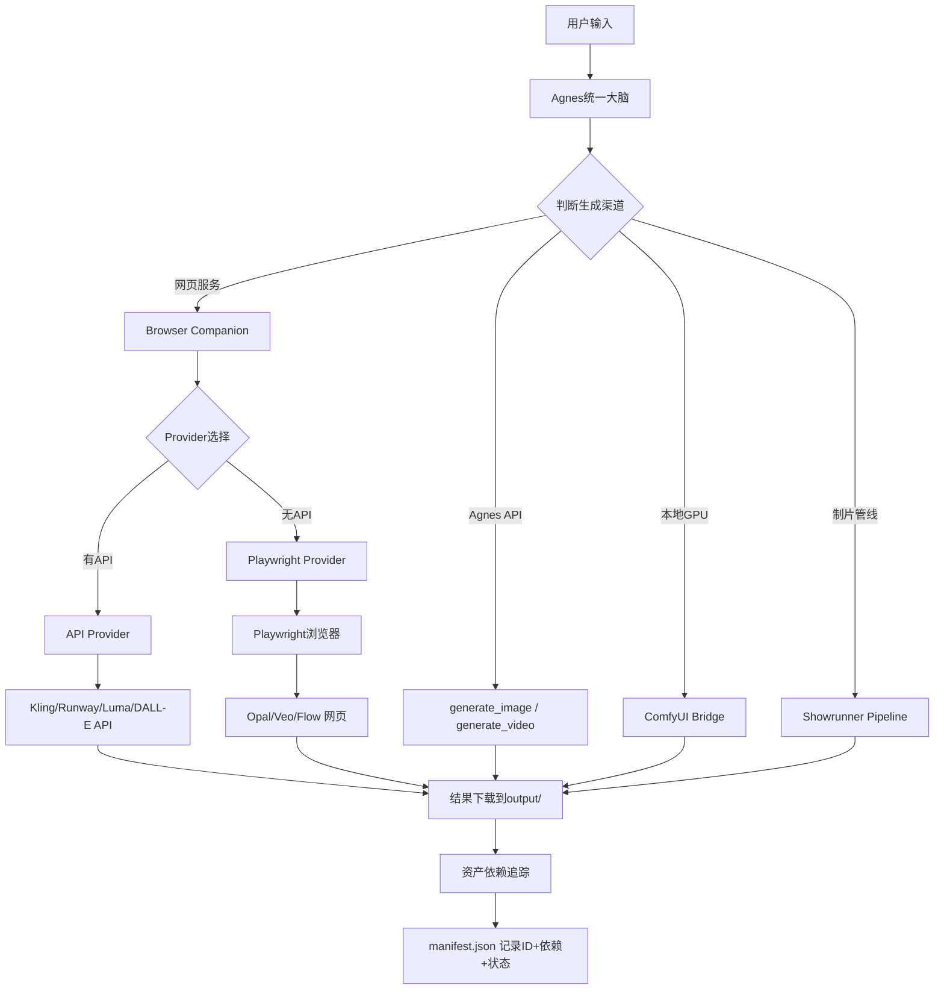

## 用户需求

### 一、Browser Companion 全自动

把新烬龙V2的"浏览器伴侣"（半手动Chrome扩展，用户需手动粘贴提示词、点击生成、等待、手动发送结果）升级为Playwright全自动方案。覆盖8个在线服务：

| 服务 | 首选方案 | 后备方案 |
| --- | --- | --- |
| 可灵 Kling | 官方API | Playwright浏览器自动化 |
| 即梦 Jimeng | 官方API | Playwright浏览器自动化 |
| Runway | 官方API | Playwright浏览器自动化 |
| Luma | 官方API | Playwright浏览器自动化 |
| ChatGPT DALL-E | OpenAI API | Playwright浏览器自动化 |
| Gemini | Gemini API | Playwright浏览器自动化 |
| Google Opal | Playwright浏览器自动化 | — |
| Veo/Flow | Playwright浏览器自动化 | — |


Playwright全自动流程：打开网站 → 加载已保存登录session → 自动填入提示词 → 点击生成按钮 → 轮询等待完成 → 下载结果到output/ → 反馈路径给Agnes。首次使用需用户手动登录一次，Playwright保存session后续自动复用。

### 二、资产依赖追踪

每个生成物（资产图、关键帧、视频段等）拥有唯一ID和父子依赖关系记录。用户说"第3个关键帧太暗了，重做"时，自动标记受影响的子节点为blocked，不牵连无关链路。数据结构示例：

```
keyframe-03 (status: needs_redo)
  depends_on: [character-01, scene-02]
  depended_by: [video-seg-03]
  → 重做后 video-seg-03 自动标记为 blocked，其他段不受影响
```

### 三、保障全部输入路径

10种输入组合路径（纯文本、文档、本地视频、视频链接、资产图片、文本+资产、文档+资产、视频+文本、视频+资产、完整多模态）均需正常工作。当前用视频上传能跑通基本流程，但其他路径也不能有任何执行障碍。

## 技术方案

### 一、Browser Companion 模块

**新建文件：`core/browser_tools.py`**

三层架构：

1. **Provider层**：8个provider适配器，每个实现 `submit()` / `poll()` / `download()` 三个方法。API优先的可灵/即梦/Runway/Luma/DALL-E 直接调HTTP API，无API的Opal/Veo用Playwright。
2. **Session层**：`BrowserSession` 类管理Playwright浏览器实例和登录状态持久化（保存到`output/browser_sessions/`）。
3. **Task层**：`BrowserTaskManager` 管理任务生命周期（创建→提交→轮询→下载→导入），任务状态持久化到`output/browser_tasks.json`。

**工具体系（6个工具，始终可用）：**

| 工具名 | 功能 |
| --- | --- |
| `browser_generate` | 提交生成任务到指定provider（provider, prompt, image_path?, config?） |
| `browser_check` | 查询任务状态（task_id） |
| `browser_download` | 下载已完成任务的结果文件（task_id） |
| `browser_providers` | 列出可用provider及状态 |
| `browser_setup` | 打开浏览器让用户首次登录某个provider，保存session |
| `browser_cancel` | 取消进行中的任务 |


**关键实现细节：**

- Playwright以`chromium.launch_persistent_context`启动，user_data_dir指向`output/browser_sessions/{provider}/`，登录态自动持久化
- API provider用httpx调官方API，错误时自动降级到Playwright后备
- 所有任务有超时保护（最长15分钟）
- Provider适配器基类定义统一接口，新增provider只需实现三个方法

### 二、资产依赖追踪系统

**增强：`core/pipeline_tools.py`**

在现有manifest schema中增加依赖追踪字段：

```python
class AssetNode:
    id: str          # 全局唯一ID，如 "kf-03"
    type: str        # "character"|"scene"|"prop"|"vehicle"|"keyframe"|"video_segment"
    status: str      # "pending"|"generating"|"done"|"needs_redo"|"blocked"
    path: str        # 文件路径
    depends_on: list[str]   # 依赖的父节点ID列表
    depended_by: list[str]  # 依赖此节点的子节点ID列表
    metadata: dict   # prompt/model/参数等
```

**新增工具：**

- `regenerate_asset(asset_id, new_params?)` ：重做指定资产，自动将下游标记为blocked
- `project_dependency_graph()` ：返回当前项目的依赖树（供Agnes理解影响范围）
- `mark_asset_ok(asset_id)` ：用户确认某资产满意后手动标记done，解除下游blocked

**重做逻辑：**

```
用户: "第3个关键帧太暗了，偏暖色调重做"
→ Agnes调用 regenerate_asset("kf-03", {prompt: "偏暖色调..."})
→ 系统: kf-03 → needs_redo
        video-seg-03 → blocked (因为依赖kf-03)
        video-seg-01, video-seg-02 → 不受影响
→ Agnes重新生成kf-03 → done后自动解除video-seg-03的blocked
```

### 三、工具注册

**修改：`core/tools.py`**

- 新增`BROWSER_TOOL_DEFS`列表（与`COMFYUI_TOOL_DEFS`同级）
- `load()`方法增加`browser: bool`参数，但Browser工具始终默认加载（设为BUILTIN_TOOLS的一部分）

**修改：`core/chat.py`**

- 统一大脑提示词中新增"Web服务生成"和"资产追踪"章节
- 移除"我无法访问外部网页服务"的错误路径

**修改：`skills/showrunner.skill.json`**

- 新增"资产重做规则"章节
- 新增"Web服务Provider选择"章节
- 确保10条路径均等对待，不偏向视频路径

### 四、依赖安装

**修改：`pyproject.toml`**

- 新增`playwright>=1.40`

### 五、启动器同步

**修改：`launcher.py`**

- 模式描述更新为："直接聊天 — 写代码/生图/做视频/网页生成/一键制片"

## 架构设计



## 目录结构

```
agnes-smart-studio/
├── core/
│   ├── browser_tools.py       # [NEW] Browser Companion：8个provider适配器 + Playwright自动化 + 任务管理
│   ├── pipeline_tools.py      # [MODIFY] 增加AssetNode依赖追踪 + regenerate_asset等工具
│   ├── tools.py               # [MODIFY] 新增BROWSER_TOOL_DEFS，load()默认加载browser工具
│   ├── chat.py                # [MODIFY] 统一提示词增加Web生成和资产追踪章节
│   ├── comfyui_tools.py       # 不变
│   └── ...
├── skills/
│   └── showrunner.skill.json  # [MODIFY] 新增资产重做规则 + Web Provider选择 + 路径平等
├── pyproject.toml             # [MODIFY] 新增playwright依赖
├── launcher.py                # [MODIFY] 更新模式描述
└── output/
    ├── browser_sessions/      # [NEW] Playwright登录态持久化
    └── browser_tasks.json     # [NEW] 任务状态持久化
```