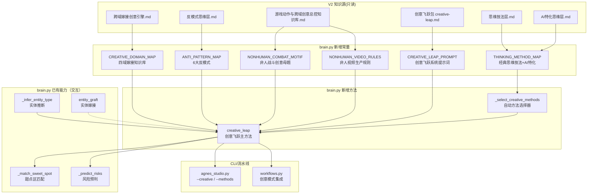

# 方案：将V2超越常人思维方法嵌入 Agnes Smart Studio

> 原则：只读取V2知识源，不修改V2任何文件
> 
> 前置依赖：已完成的实体知识嵌入（ENTITY_TYPE_MAP / GRAFT_TARGETS 等）

---

## 现状差距

| 能力 | V2 知识源 | Agnes 现状 |
|------|-----------|-----------|
| 跨域嫁接创意引擎 | 四域公式 A×B×C×V + 5大信条 + 创意4步流程 + 三问筛选法 | 无（仅有实体嫁接8种目标，无系统化创意方法） |
| AI特化思维层 | 潜空间导航/Prompt炼金术/风格劫持/Glitch美学 | 无（Prompt增强靠LLM自由发挥，无方法论驱动） |
| 经典思维技法 | SCAMPER/TRIZ 15条/第一性原理/六顶帽/设计思维 | 无 |
| 反模式思维层 | 6大反模式 + 反模式互乘矩阵 | 无（仅有失败修复映射，无创意破坏方法） |
| 创意飞跃包 | 14种正式创意方法 + 护栏规则 | 无 |
| 非人战斗创意母题 | 非人+人类武术=反差感 / 非人+荒诞=荒诞感 | 无（仅有实体类型推断，无创意母题指导） |
| 非人视频生产规则 | I2V首帧驱动/甜点区规格/提示词组装流水线 | 无（仅有视频三一律，无非人专属生产约束） |
| 嫁接公式系统 | 动作域×载体域×物理域×视觉域 + 高爆点矩阵 + 物理域破坏适配表 | 无（GRAFT_TARGETS仅列出8种目标，无组合引擎） |

**核心差距**：Agnes 已有"识别非人实体→匹配甜点区→风险预判"的**防御性**能力，但完全缺失**创造性**能力——即"如何用超越常人的思维方法，主动生成前所未有的创意提示词"。

---

## 设计哲学

1. **防御 vs 创造**：现有的实体感知+甜点区+风险预判是"防御性"的（防止失败），新嵌入的思维方法是"创造性"的（主动生成突破性创意）
2. **触发机制**：创造性方法不应每次都触发——通过用户显式请求（`--creative`/`--leap`）或关键词自动检测（"创意"/"前所未有"/"突破"等）来激活
3. **护栏先行**：创意飞跃是候选方案，不是自动真理。天马行空有用当且仅当目标、冲突、压力、情绪转折和回报仍然清晰可读
4. **内嵌方式**：与现有架构一致，以 Python 硬编码常量 + System Prompt 字符串的形式内嵌到 `brain.py`，零外部依赖

---

## 实施方案（10步）

### 第1步：新增 `CREATIVE_DOMAIN_MAP` 四域嫁接知识库

**文件**：`core/brain.py`（模块级常量，在 `GRAFT_TARGETS` 之后）

**来源**：V2 `游戏招数收集-跨域嫁接创意引擎.md`

将嫁接四域公式系统化：

```python
CREATIVE_DOMAIN_MAP = {
    # ── 动作域 (A) ──
    "action": {
        "A-STRIKE": {"name_cn": "打击", "examples": "拳击、掌击、肘击、膝击、头槌"},
        "A-THROW": {"name_cn": "投技", "examples": "过肩摔、背投、旋风投、抓甩"},
        "A-JOINT": {"name_cn": "关节技", "examples": "锁臂、扭腕、反关节、绞技"},
        "A-PROJECTILE": {"name_cn": "飞行道具", "examples": "气弹、箭矢、光束、追踪弹"},
        "A-MOVEMENT": {"name_cn": "位移", "examples": "瞬移、冲刺、闪避、飞行"},
        "A-AOE": {"name_cn": "范围攻击", "examples": "冲击波、领域展开、地裂、风暴"},
        "A-SUMMON": {"name_cn": "召唤/分身", "examples": "影子分身、元素召唤、灵体召唤"},
        "A-CONTROL": {"name_cn": "控制", "examples": "念力、束缚、冰冻、时间停滞"},
        "A-DEFENSE": {"name_cn": "防御", "examples": "护盾、格挡、吸收、反弹"},
        "A-TRANSFORM": {"name_cn": "变身/形态转换", "examples": "觉醒、兽化、机甲合体、元素化"},
    },
    # ── 载体域 (B) ──
    "carrier": {
        "B-HUMAN": {"name_cn": "人体", "visual_traits": "标准人体比例、关节结构、肌肉系统"},
        "B-MACHINE": {"name_cn": "机械体", "visual_traits": "金属外壳、伺服关节、管道线路、面板缝隙"},
        "B-OBJECT": {"name_cn": "日常物品", "visual_traits": "家具、工具、文具、乐器、生活用品"},
        "B-ELEMENT": {"name_cn": "自然元素", "visual_traits": "流体形态、半透明、可塑性、发光/发光/粒子"},
        "B-ARCHITECTURE": {"name_cn": "建筑/地标", "visual_traits": "巨大尺度、几何结构、内外空间"},
        "B-CREATURE": {"name_cn": "生物/怪物", "visual_traits": "非人比例、异形肢体、有机纹理、翅膀/尾巴/角"},
        "B-ABSTRACT": {"name_cn": "抽象概念", "visual_traits": "非实体、象征性表现、影子/镜子/时间/记忆/声音"},
        "B-FOOD": {"name_cn": "食物", "visual_traits": "柔软质感、色泽、蒸汽、分层结构"},
    },
    # ── 物理域 (C) ── "超越常人思维的核心引擎" ──
    "physics": {
        "P-GRAVITY": {"name_cn": "重力", "break_options": ["重力反转(上落)", "重力倍增(压扁)", "零重力(漂浮)", "方向性重力(侧壁行走)"]},
        "P-TIME": {"name_cn": "时间", "break_options": ["时间倒流", "时间加速", "时间冻结", "时间分叉(同时存在多个时间线)"]},
        "P-RIGIDITY": {"name_cn": "刚体", "break_options": ["刚体柔性化(铁管弯曲)", "柔性刚体化(水流变刀)", "半固态(果冻化)"]},
        "P-TRAJECTORY": {"name_cn": "弹道", "break_options": ["直线变螺旋", "追踪弹(转弯)", "分裂弹", "回旋镖(返回)"]},
        "P-SCALE": {"name_cn": "尺度", "break_options": ["微缩(蚂蚁大小)", "超巨大(山岳大小)", "尺度错位(手心宇宙)"]},
        "P-SPACE": {"name_cn": "空间", "break_options": ["空间折叠(瞬移)", "空间镜像(左右互换)", "口袋空间", "3D进2D"]},
        "P-MATERIAL": {"name_cn": "材质", "break_options": ["水变玻璃(碎裂)", "金属变液体", "肉体变数据", "影子变固体"]},
        "P-CAUSALITY": {"name_cn": "因果", "break_options": ["结果先于原因(弹孔先出)", "原因消失(打了没效果)", "因果链(多米诺)"]},
        "P-FRICTION": {"name_cn": "摩擦力", "break_options": ["零摩擦(永动滑行)", "超摩擦(粘住)", "方向摩擦(只滑不退)"]},
        "P-INERTIA": {"name_cn": "惯性", "break_options": ["零惯性(瞬停瞬转)", "超惯性(停不下来)", "惯性存储(蓄力释放)"]},
    },
    # ── 视觉域 (V) ──
    "visual": {
        "V-ANIME": "动漫风格",
        "V-REALISTIC": "写实电影",
        "V-INK": "水墨画",
        "V-PIXEL": "像素风",
        "V-LOWPOLY": "Low-poly",
        "V-CYBERPUNK": "赛博朋克",
        "V-WASTELAND": "废土",
        "V-MINIMAL": "极简",
        "V-SURREAL": "超现实",
        "V-CLAY": "黏土动画",
    },
}
```

**5大核心信条**（注入LLM System Prompt）：

```
1. 先有画面，再找方法——不要让"能不能做"杀死"好不好看"
2. 荒谬是创意的入场券
3. 一切视觉元素都是可拆卸的原子
4. 跨域嫁接是最快的创意生产方式
5. 失败的分镜不是浪费，是知识库的养料
```

**创意生成4步流程**（注入方法逻辑）：
```
① 脑暴播种（随机组合域）→ ② 概念成形（三问筛选法）→ ③ 分镜拆解 → ④ Prompt输出
```

**三问筛选法**（注入LLM判断逻辑）：
```
Q1: 这个画面让我兴奋吗？
Q2: 有至少2个从来没见过的视觉元素吗？
Q3: 7个以内分镜讲得清吗？
```

---

### 第2步：新增 `ANTI_PATTERN_MAP` 反模式思维知识库

**文件**：`core/brain.py`（模块级常量，在 `CREATIVE_DOMAIN_MAP` 之后）

**来源**：V2 `游戏招数收集-反模式思维层.md`

```python
ANTI_PATTERN_MAP = {
    "category_error": {
        "name_cn": "类别错误",
        "core_operation": "A类事物放入B类框架",
        "description": "物理破坏改变世界规则，类别破坏改变你看世界的框架本身",
        "example": "天气预报报道魔法战争、数学公式描述感情、建筑蓝图画人体",
        "visual_impact": 4,  # ★★★★
        "prompt_formula": "[concept_from_domain_A] performed as [format_of_domain_B]",
    },
    "scale_singularity": {
        "name_cn": "尺度奇点",
        "core_operation": "尺度推向极端",
        "description": "无限大或无限小的尺度创造认知断裂",
        "example": "一滴汗里的宇宙战争、指尖上的文明、呼吸间的纪元",
        "visual_impact": 5,  # ★★★★★
        "prompt_formula": "[microscopic element] containing [cosmic scale event]",
    },
    "time_slice": {
        "name_cn": "时间切片",
        "core_operation": "多重时间同时可见",
        "description": "过去/现在/未来同框，打破线性时间叙事",
        "example": "少年与老年并肩站立、建筑从废墟到建成的过程同时可见",
        "visual_impact": 5,  # ★★★★★
        "prompt_formula": "[subject] at [past_state] and [future_state] visible simultaneously",
    },
    "material_paradox": {
        "name_cn": "物质悖论",
        "core_operation": "材料背叛天性",
        "description": "材料表现与其物理天性完全相反",
        "example": "水像玻璃一样碎裂、火焰像冰一样冻结、钢铁像丝带一样飘动",
        "visual_impact": 3,  # ★★★
        "prompt_formula": "[material] behaving like [opposite_material]",
    },
    "causal_inversion": {
        "name_cn": "因果倒置",
        "core_operation": "结果先于原因",
        "description": "打破因果律，效果出现在原因之前",
        "example": "弹孔先出现子弹后飞出、伤口先流血后刀砍来、建筑先倒塌后地震",
        "visual_impact": 4,  # ★★★★
        "prompt_formula": "[effect] appears before [cause]",
    },
    "dimension_fold": {
        "name_cn": "维度折叠",
        "core_operation": "空间吃掉自己",
        "description": "3D进入2D、高维入侵低维、空间自身折叠",
        "example": "3D角色走进2D漫画格子、手伸出画面边框、镜子里的世界是另一个维度",
        "visual_impact": 5,  # ★★★★★
        "prompt_formula": "[3D_subject] entering [2D_space] or [dimension_breach]",
    },
}
```

**反模式互乘规则**（注入LLM）：
```
同一个创意概念 × 6种反模式 = 6个完全不同的视觉变体
在"创意飞跃"模式下，自动对核心概念施加2-3种反模式变异
```

---

### 第3步：新增 `THINKING_METHOD_MAP` 经典思维技法知识库

**文件**：`core/brain.py`（模块级常量，在 `ANTI_PATTERN_MAP` 之后）

**来源**：V2 `游戏招数收集-思维技法层.md` + `游戏招数收集-AI特化思维层.md`

```python
THINKING_METHOD_MAP = {
    # ── SCAMPER ──
    "SCAMPER": {
        "name_cn": "SCAMPER创新法",
        "operations": {
            "S": {"name_cn": "替换", "prompt_op": "替换主体/材质/环境的某个核心元素"},
            "C": {"name_cn": "合并", "prompt_op": "将两个不相干的视觉概念合并"},
            "A": {"name_cn": "借用", "prompt_op": "从其他领域借用视觉语言"},
            "M": {"name_cn": "修改", "prompt_op": "修改尺度/速度/方向/质感"},
            "P": {"name_cn": "转用", "prompt_op": "将元素转用于完全不同的场景"},
            "E": {"name_cn": "消除", "prompt_op": "消除一个核心视觉元素，看剩余如何自洽"},
            "R": {"name_cn": "反转", "prompt_op": "反转时间/因果/上下/内外/主客"},
        },
    },
    # ── TRIZ 15条 ──
    "TRIZ": {
        "name_cn": "TRIZ发明原理",
        "principles": {
            1: "分割—将整体拆为独立可动部分",
            2: "抽取—只保留最关键的特征",
            3: "合并—将同类或相邻功能合为一体",
            5: "嵌套—一个结构套入另一个",
            10: "预先作用—提前设置效果",
            13: "反向—做相反的事",
            15: "动态性—让静态变动态",
            17: "维度变化—移到另一个维度或层",
            28: "机械替代—用声/光/电磁/气味替代物理接触",
            32: "颜色改变—改变透明度/颜色/发光性",
            35: "参数变化—改变浓度/密度/弹性/温度",
        },
    },
    # ── 第一性原理 ──
    "FIRST_PRINCIPLES": {
        "name_cn": "第一性原理拆解",
        "decomposition": {
            "combat": "冲突 + 表达 + 反馈 + 结果 → 每个要素都可以被替换/反转",
            "character": "轮廓 + 材质 + 动作逻辑 + 识别标记 → 每个要素都可以被替换/反转",
            "scene": "光源 + 空间 + 时间 + 观者位置 → 每个要素都可以被替换/反转",
        },
    },
    # ── 六顶思考帽 ──
    "SIX_HATS": {
        "name_cn": "六顶思考帽审查",
        "hats": {
            "WHITE": "事实—这个概念的技术可实现性如何？",
            "RED": "直觉—这个画面让我兴奋吗？情绪反应？",
            "BLACK": "风险—最可能失败在哪里？模型会误解什么？",
            "YELLOW": "机会—如果成功了，最惊艳的效果是什么？",
            "GREEN": "变体—能否换一种实体类型/载体/物理破坏得到更好的变体？",
            "BLUE": "决策—综合判断，是否采用？需要什么护栏？",
        },
    },
    # ── 设计思维（生理反应反向设计）──
    "DESIGN_THINKING": {
        "name_cn": "生理反应反向设计",
        "reaction_map": {
            "瞳孔放大": "→ 暗→亮的突变（先全黑1秒再爆光）",
            "屏息": "→ 极慢动作（1/10速度）+ 消除环境音",
            "鸡皮疙瘩": "→ 大空间展开+神圣光+从极近到极远的镜头跳跃",
            "心跳加速": "→ 快切+不完整画面+闪帧+残影",
            "落泪冲动": "→ 长镜头+微弱环境变化+静止中的一个小动作",
        },
    },
    # ── AI特化思维 ──
    "AI_LATENT_NAV": {
        "name_cn": "潜空间导航",
        "distance_types": {
            "near_fusion": "概念距离近→自然融合→加强版创意",
            "mid_jump": "有距离但共享维度→怪但合理的创意",
            "far_collision": "几乎不共享维度→从未存在过的画面",
        },
        "corridor_example": "坦克→机械→金属→人体关节→运动→舞蹈→芭蕾",
    },
    "AI_STYLE_HIJACK": {
        "name_cn": "风格劫持",
        "principle": "把两个互斥视觉风格塞进同一个prompt，利用AI无法完美融合的裂缝作为独特视觉效果",
        "top_pair": "赛博朋克 × 水墨画",
    },
    "AI_GLITCH": {
        "name_cn": "Glitch美学",
        "types": {
            "structure_fault": "结构故障—肢体错位/建筑扭曲/空间折叠",
            "motion_fault": "运动故障—残影/卡帧/时间跳跃",
            "texture_fault": "纹理故障—像素化/数据流/材质替换",
            "color_fault": "色彩故障—色差/通道分离/过饱和",
        },
    },
}
```

---

### 第4步：新增 `NONHUMAN_COMBAT_MOTIF` 非人战斗创意母题

**文件**：`core/brain.py`（模块级常量，在 `THINKING_METHOD_MAP` 之后）

**来源**：V2 `游戏动作与跨域创意总控知识库.md`

```python
NONHUMAN_COMBAT_MOTIF = {
    "contrast": {
        "name_cn": "反差感母题",
        "formula": "非人主体 + 人类武术结构 = 反差感",
        "description": "非人躯体执行人类格斗逻辑，产生"它真的在打"的可信感",
        "rules": [
            "表达重点放在动作逻辑、力量传递和视觉后果，不要停留在'像人'",
            "非人主体的'会打' ≠ 拟人摆姿势，而是让观众看见它真的遵守一套可读的战斗逻辑",
            "先问：它的发力点在哪、关节逻辑是什么、攻击节奏如何表现、命中后怎么反应",
        ],
        "prompt_template": "Preserve [non-human body type] anatomy. Apply [human martial technique] adapted to [entity joint structure]. Show force transfer through [entity material/energy logic]. Impact reaction: [entity-specific feedback].",
    },
    "absurdity": {
        "name_cn": "荒诞感母题",
        "formula": "非人主体 + 不可思议构想 = 荒诞感",
        "description": "非人躯体执行完全违背自身物理的创意动作，产生'这不可能但好看'的冲击",
        "rules": [
            "荒诞动作仍然需要一条可读的因果链（即使因果是反物理的）",
            "先保留攻防节奏、发力路径、命中反馈，再决定外形和超现实程度",
            "荒诞≠混乱，荒诞=违反预期但内部自洽",
        ],
        "prompt_template": "[Non-human entity] performs [impossible action] through [anti-physics mechanism]. Maintain readable [rhythm/beat] despite [absurd physics]. Impact: [surprising but internally consistent result].",
    },
}
```

---

### 第5步：新增 `NONHUMAN_VIDEO_RULES` 非人角色视频生产规则

**文件**：`core/brain.py`（模块级常量，在 `NONHUMAN_COMBAT_MOTIF` 之后）

**来源**：V2 `游戏动作与跨域创意总控知识库.md` + `视频甜点区规则`

```python
NONHUMAN_VIDEO_RULES = {
    "i2v_first_frame": {
        "name_cn": "I2V首帧驱动规则",
        "max_allowed": "1个非人主体 + 1个清楚轮廓 + 1个动作短语 + 1个简单镜头运动",
        "suitable_actions": [
            "step forward and palm strike",
            "guarded stance shift",
            "one elbow block",
            "one precise dodge",
            "slow energy pulse",
            "ethereal drift forward",
        ],
        "unsuitable_actions": [
            "连招/combo",
            "多次变形/multiple transformations",
            "多个身体同时行动/multiple bodies acting simultaneously",
            "复杂武器/complex weapon manipulation",
        ],
        "design_lock_template": "Preserve the same [non-human body], same silhouette, same material, same head/face rule, same location.",
    },
    "sweet_spot_specs": {
        "name_cn": "甜点区规格",
        "default_method": "逐镜balanced",
        "forbidden": [
            "多连招",
            "额外肢体",
            "额外角色",
            "人脸污染（非人角色出现人脸上）",
        ],
        "prompt_structure": "Design lock: [body material], [head/face rule], [signature seams/light]. One dominant action phrase: [one martial technique] then [recovery stance].",
    },
    "prompt_assembly_pipeline": {
        "name_cn": "提示词组装流水线",
        "steps": [
            "步骤1: 视觉风格前缀（从视觉域V提取）",
            "步骤2: 载体描述（从载体域B提取，含材质/轮廓/尺度）",
            "步骤3: 动作描述（从动作域A提取，参考知识库提示词）",
            "步骤4: 物理特效（从物理域C提取，含反物理参数）",
            "步骤5: VFX参数（从知识库VFX体系提取）",
            "步骤6: 镜头/氛围",
        ],
    },
}
```

---

### 第6步：新增 `CREATIVE_LEAP_PROMPT` 系统提示词（创意飞跃模式专用）

**文件**：`core/brain.py`（模块级常量，在 `ENHANCE_VIDEO_PROMPT` 之后）

**来源**：综合V2 `creative-leap.md` + `跨域嫁接创意引擎.md` + `反模式思维层.md` + `思维技法层.md`

```python
CREATIVE_LEAP_PROMPT = """你是超越常人的创意Prompt工程师。你不仅仅优化用户的描述——你主动运用跨域嫁接、反模式破坏、经典思维技法来创造前所未有的视觉概念。

输出JSON（不要markdown代码块，直接输出JSON）：
{
    "original_concept": "用户原始概念提取",
    "creative_leaps": [
        {
            "method": "使用的方法名（如：跨域嫁接/反模式-类别错误/SCAMPER-替换/TRIZ-分割/潜空间远距对撞/风格劫持）",
            "leap_description": "创意飞跃的中文描述（2-3句话）",
            "optimized_prompt": "飞跃后的英文提示词（50-100词）",
            "key_visual_elements": ["前所未见的视觉元素1", "元素2"],
            "anti_physics_used": ["使用的反物理参数（如有）"],
            "negative_prompt": "负面约束（英文逗号分隔，含创意特有的失败风险）"
        }
    ],
    "recommended_leap_index": 0,
    "guardrail_check": {
        "story_function_readable": true/false,
        "conflict_visible": true/false,
        "emotional_turn_clear": true/false,
        "visual_payoff_worth": true/false
    }
}

创意方法库（按需选用1-3种）：

【跨域嫁接】
- 公式：创意概念 = 动作域(A) × 载体域(B) × 物理域(C) × 视觉域(V)
- 从四个域中各选一个元素组合，优先选择跨域距离远的组合
- 物理域是超越常人思维的核心引擎——大部分人的想象力卡在物理域
- 5大信条：先有画面再找方法 / 荒谬是入场券 / 视觉元素是可拆卸原子 / 跨域嫁接最快 / 失败是养料

【6大反模式】
- 类别错误：A类事物放入B类框架（天气预报报道魔法战争）
- 尺度奇点：尺度推向极端（一滴汗里的宇宙战争）
- 时间切片：多重时间同时可见（少年与老年并肩站立）
- 物质悖论：材料背叛天性（水像玻璃一样碎裂）
- 因果倒置：结果先于原因（弹孔先出子弹后飞）
- 维度折叠：空间吃掉自己（3D角色走进2D漫画格子）
- 互乘规则：同一概念 × 不同反模式 = 不同视觉变体

【SCAMPER】S替换/C合并/A借用/M修改/P转用/E消除/R反转
【TRIZ】分割/抽取/合并/嵌套/预先作用/反向/动态性/维度变化/机械替代/颜色改变/参数变化
【第一性原理】拆到最底层再重构：战斗=冲突+表达+反馈+结果，每要素可替换/反转
【潜空间导航】远距对撞产生"从未存在过"的画面
【风格劫持】互斥风格碰撞产生裂缝视觉
【Glitch美学】结构故障/运动故障/纹理故障/色彩故障

【非人创意母题】
- 反差感：非人主体+人类武术结构=反差感，重点在动作逻辑和力量传递
- 荒诞感：非人主体+不可思议构想=荒诞感，荒诞≠混乱，荒诞=违反预期但内部自洽

护栏规则（必须遵守）：
1. 创意飞跃是候选方案，不是自动真理
2. 天马行空有用当且仅当：目标、冲突、压力、情绪转折和回报仍然清晰可读
3. 如果guardrail_check任何一项为false，必须标注风险并给出修复建议
4. 每个创意飞跃必须通过三问筛选：Q1画面让我兴奋吗？Q2有至少2个前所未见的视觉元素？Q3 7个以内分镜讲得清吗？
5. 非人实体的表面材质/能量逻辑不可被创意方法随意破坏——创意改变的是"如何表现"，不是"是什么"
"""
```

---

### 第7步：新增 `creative_leap()` 方法（SmartBrain 类内）

**文件**：`core/brain.py`（SmartBrain 类内，在 `entity_graft()` 之后）

```python
def creative_leap(self, user_prompt: str, methods: list[str] | None = None) -> dict:
    """创意飞跃：运用超越常人的思维方法主动生成突破性创意

    来源：V2 跨域嫁接创意引擎 + 反模式思维层 + 思维技法层 + AI特化思维层 + 创意飞跃包

    Args:
        user_prompt: 用户原始描述
        methods: 指定使用的创意方法列表，可选值：
            "cross_domain_graft" / "anti_pattern" / "SCAMPER" / "TRIZ"
            "first_principles" / "latent_nav" / "style_hijack" / "glitch"
            None 时由系统自动选择2-3种最匹配的方法
    Returns:
        创意飞跃结果 dict，包含多个候选方案+护栏检查
    """
    # 自动选择方法
    if not methods:
        methods = self._select_creative_methods(user_prompt)

    # 注入四域知识和实体信息
    entity_type, surface_policy = self._infer_entity_type(user_prompt)
    context = f"原始描述：{user_prompt}\n\n"
    if entity_type:
        context += f"[实体类型：{ENTITY_TYPE_MAP[entity_type]['name_cn']}({entity_type})]\n"
        context += f"[表面策略：{surface_policy}]\n"
        context += "[创意规则：非人实体的表面材质/能量逻辑不可被创意方法随意破坏]\n\n"

    # 注入选定的方法说明
    method_descriptions = []
    for m in methods:
        if m == "cross_domain_graft":
            method_descriptions.append(
                "【跨域嫁接】从动作域/载体域/物理域/视觉域中各选一个元素组合，"
                "优先选择跨域距离远的组合，重点突破物理域"
            )
        elif m == "anti_pattern":
            method_descriptions.append(
                "【反模式】从6大反模式中选择1-2种施加于概念："
                "类别错误/尺度奇点/时间切片/物质悖论/因果倒置/维度折叠"
            )
        elif m == "SCAMPER":
            method_descriptions.append("【SCAMPER】从S替换/C合并/A借用/M修改/P转用/E消除/R反转中选择2-3种操作")
        elif m == "TRIZ":
            method_descriptions.append("【TRIZ】从分割/抽取/合并/嵌套/反向/维度变化/机械替代等中选择1-2条")
        elif m == "first_principles":
            method_descriptions.append("【第一性原理】将概念拆到最底层要素，每个要素替换/反转后重构")
        elif m == "latent_nav":
            method_descriptions.append("【潜空间导航】寻找与原始概念远距离的概念进行对撞，产生'从未存在过'的画面")
        elif m == "style_hijack":
            method_descriptions.append("【风格劫持】将两个互斥视觉风格塞入同一提示词，利用裂缝产生独特视觉")
        elif m == "glitch":
            method_descriptions.append("【Glitch美学】引入结构故障/运动故障/纹理故障/色彩故障作为风格")

    context += f"指定方法：{' / '.join(method_descriptions)}\n"

    text = self._ask_brain(CREATIVE_LEAP_PROMPT, context, temperature=0.8)
    result = self._parse_json(text)
    result.setdefault("original_concept", user_prompt)
    result.setdefault("creative_leaps", [])
    result.setdefault("guardrail_check", {
        "story_function_readable": True,
        "conflict_visible": True,
        "emotional_turn_clear": True,
        "visual_payoff_worth": True,
    })

    # 对每个飞跃结果叠加甜点区和风险预判
    for leap in result.get("creative_leaps", []):
        if "optimized_prompt" in leap:
            template = self._match_sweet_spot(leap["optimized_prompt"], "image", entity_type)
            if template:
                leap["sweet_spot"] = template["name"]
                leap["negative_prompt"] = self._merge_negative(
                    leap.get("negative_prompt", ""), template["negative"]
                )

    # 推荐方案的安全检查
    idx = result.get("recommended_leap_index", 0)
    leaps = result.get("creative_leaps", [])
    if leaps and idx < len(leaps):
        recommended = leaps[idx]
        # 如果推荐方案未通过护栏，降级到安全模式
        guard = result.get("guardrail_check", {})
        if not all(guard.values()):
            result["guardrail_warning"] = "推荐方案未通过护栏检查，建议选择更保守的方案或降低创意强度"

    # 记录使用的方法
    result["methods_used"] = methods

    return result
```

---

### 第8步：新增 `_select_creative_methods()` 自动方法选择器

**文件**：`core/brain.py`（SmartBrain 类内，在 `creative_leap()` 之前）

```python
def _select_creative_methods(self, prompt: str) -> list[str]:
    """根据用户描述自动选择最匹配的创意方法

    Args:
        prompt: 用户原始提示词
    Returns:
        2-3种最匹配的创意方法标识列表
    """
    p = prompt.lower()
    methods = []

    # 关键词→方法映射
    method_keywords = {
        "cross_domain_graft": ["嫁接", "跨域", "组合", "混搭", "graft", "cross-domain", "mix", "组合"],
        "anti_pattern": ["反模式", "颠覆", "破坏", "反转", "悖论", "反常", "anti-pattern", "paradox", "invert"],
        "SCAMPER": ["替换", "合并", "修改", "消除", "substitute", "combine", "modify", "eliminate"],
        "TRIZ": ["发明", "原理", "分割", "嵌套", "invent", "principle", "segment", "nest"],
        "first_principles": ["拆解", "本质", "底层", "基本", "principle", "fundamental", "decompose"],
        "latent_nav": ["前所未有", "从未见过", "novel", "unprecedented", "从未存在"],
        "style_hijack": ["风格碰撞", "混搭风格", "风格冲突", "style clash", "style fusion"],
        "glitch": ["故障", "glitch", "bug", "错误", "崩溃", "故障艺术", "corrupt"],
    }

    # 评分选择
    scores = {}
    for method, keywords in method_keywords.items():
        score = sum(1 for kw in keywords if kw in p)
        if score > 0:
            scores[method] = score

    # 按评分排序取前3
    sorted_methods = sorted(scores.items(), key=lambda x: x[1], reverse=True)
    if sorted_methods:
        methods = [m for m, s in sorted_methods[:3]]

    # 兜底：默认使用跨域嫁接+反模式（最通用的创造性组合）
    if not methods:
        methods = ["cross_domain_graft", "anti_pattern"]

    return methods
```

---

### 第9步：更新 `ENHANCE_IMAGE_PROMPT` 和 `ENHANCE_VIDEO_PROMPT` — 注入创意方法知识

**文件**：`core/brain.py`

**9.1 `ENHANCE_IMAGE_PROMPT` 增加规则**（在现有规则16条之后追加）：

```
17. 如果输入标注了[创意模式]，除了常规优化外，还必须：
    - 从物理域中至少选择1个反物理参数注入optimized_prompt
    - 在negative_prompt中追加"ordinary, expected, conventional, mundane"抑制平庸
    - 在acceptance_criteria中增加：画面包含至少1个前所未见的视觉元素
18. 非人实体的创意优化必须同时遵守：
    - 实体表面材质/能量逻辑不可被创意方法破坏（灵体不生成皮肤，机甲不生成肉体）
    - 但动作表现方式可以反物理（灵体可以时间倒流般攻击，机甲可以零惯性瞬停瞬转）
19. 非人战斗创意母题：
    - 反差感：保留人类格斗的攻防节奏和发力路径，用非人材质/能量逻辑传递力量
    - 荒诞感：反物理动作仍需可读的因果链，荒诞≠混乱
```

**9.2 `ENHANCE_VIDEO_PROMPT` 增加规则**（在现有规则13条之后追加）：

```
14. 非人角色视频的I2V首帧驱动规则：
    - 最多允许：1个非人主体 + 1个清楚轮廓 + 1个动作短语 + 1个简单镜头运动
    - 不适合：连招、多次变形、多个身体同时行动、复杂武器
    - 设计锁模板：Preserve the same [non-human body], same silhouette, same material, same head/face rule, same location.
15. 非人角色视频的甜点区规格：
    - 默认用逐镜balanced
    - 禁止多连招、额外肢体、额外角色、人脸污染
    - 提示词结构：Design lock: [body material], [head/face rule], [signature seams/light]. One dominant action phrase: [one martial technique] then [recovery stance].
16. 提示词组装流水线（按序）：
    步骤1: 视觉风格前缀 → 步骤2: 载体描述 → 步骤3: 动作描述 → 步骤4: 物理特效 → 步骤5: VFX参数 → 步骤6: 镜头/氛围
```

---

### 第10步：CLI 和流水线集成

**文件**：`agnes_studio.py` + `pipeline/workflows.py`

**10.1 `agnes_studio.py` 新增 CLI 参数**：

- `--creative` / `--leap`：启用创意飞跃模式（调用 `creative_leap()` 替代普通 `enhance_image_prompt()`）
- `--methods`：指定创意方法（逗号分隔），如 `--methods cross_domain_graft,anti_pattern`

**10.2 `pipeline/workflows.py` 创意模式集成**：

- 快速模式检测到 `--creative` 时，用 `creative_leap()` 结果中的推荐方案替代 `enhance_image_prompt()`
- 分镜模式检测到 `--creative` 时，对每个分镜调用 `creative_leap()` 生成变体方案

---

## 文件变更清单

| 文件 | 变更类型 | 具体变更 |
|------|---------|---------|
| `core/brain.py` | **新增常量** | `CREATIVE_DOMAIN_MAP`（四域嫁接知识库）、`ANTI_PATTERN_MAP`（6大反模式）、`THINKING_METHOD_MAP`（经典思维技法+AI特化）、`NONHUMAN_COMBAT_MOTIF`（非人战斗创意母题）、`NONHUMAN_VIDEO_RULES`（非人视频生产规则）、`CREATIVE_LEAP_PROMPT`（创意飞跃系统提示词） |
| `core/brain.py` | **新增方法** | `creative_leap()`、`_select_creative_methods()` |
| `core/brain.py` | **修改常量** | `ENHANCE_IMAGE_PROMPT` 追加规则17-19、`ENHANCE_VIDEO_PROMPT` 追加规则14-16 |
| `agnes_studio.py` | **修改** | 新增 `--creative`/`--leap` 参数、`--methods` 参数 |
| `pipeline/workflows.py` | **修改** | 创意模式检测和集成逻辑 |

---

## 架构图



---

## 调用流程

```
用户输入 + --creative
    ↓
agnes_studio.py 检测 --creative 标志
    ↓
brain.creative_leap(user_prompt, methods)
    ↓
_select_creative_methods() → 选择2-3种方法
    ↓
_infer_entity_type() → 判断是否非人实体
    ↓
_ask_brain(CREATIVE_LEAP_PROMPT, context) → 生成2-3个飞跃候选
    ↓
对每个候选：
  _match_sweet_spot() → 叠加甜点区
  护栏检查 → guardrail_check
    ↓
返回推荐方案 + 备选方案 + 护栏状态
    ↓
workflows.py 用推荐方案替代普通增强结果
    ↓
后续流程（生图/生视频）不变
```

---

## 与现有能力的交互关系

| 现有能力 | 创意飞跃如何交互 |
|---------|----------------|
| `entity_graft()` | 创意飞跃可以建议嫁接目标，但嫁接的执行仍走 `entity_graft()` |
| `_infer_entity_type()` | 创意飞跃继承实体推断结果，确保不破坏非人实体的材质/能量逻辑 |
| `_match_sweet_spot()` | 创意飞跃的每个候选方案都自动叠加甜点区 |
| `_predict_risks()` | 创意飞跃的每个候选方案都自动进行风险预判 |
| `enhance_image/video_prompt()` | 创意模式是**替代**（`creative_leap()`结果直接用于生成），不是叠加（不先增强再飞跃） |
| `BEAUTY_PORTRAIT_MAP` | 帅哥美女通道**不触发**创意飞跃（创意飞跃可能破坏人像质量），`--creative` 对帅哥美女无效 |

---

## 不修改的文件

- V2知识源所有文件（只读取，不修改）
- `core/client.py`（API层不变）
- `engines/video.py`（引擎层不变）
- `core/config.py`（配置层不变）
- `core/validator.py`（校验层不变）
- `ui/cli.py`（UI层不变——创意模式通过 `agnes_studio.py` 快速模式触发）
